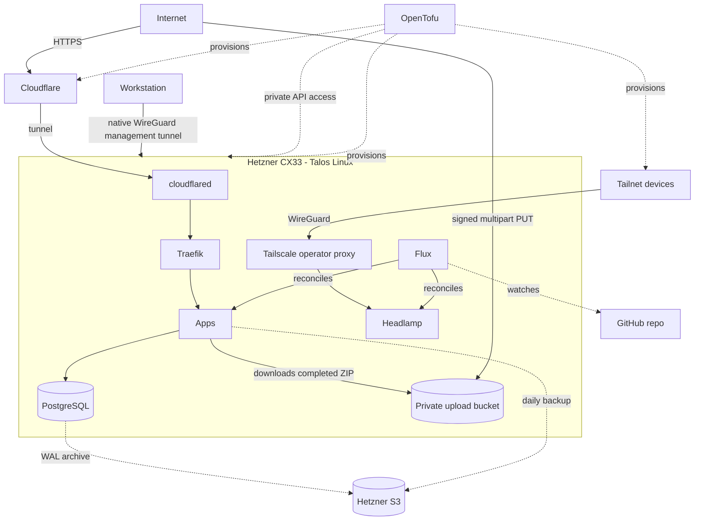

# Personal infrastructure

[](https://github.com/itay-raveh/infra/actions/workflows/ci.yaml)
[](https://github.com/itay-raveh/infra/blob/main/LICENSE)

GitOps-managed personal infrastructure for `raveh.dev`.

## Architecture



## Stack

| Tool | Role |
|---|---|
| [Talos Linux](https://talos.dev) | Immutable Kubernetes OS |
| [Flux CD](https://fluxcd.io) | GitOps reconciliation |
| [OpenTofu](https://opentofu.org) | Infrastructure provisioning |
| [Traefik](https://traefik.io) | Ingress + reverse proxy (public apps) |
| [Cloudflare Tunnel](https://developers.cloudflare.com/cloudflare-one/connections/connect-networks/) | Public app ingress without exposing an origin HTTP port |
| [WireGuard](https://www.wireguard.com/) | Key-authenticated private Kubernetes and Talos API transport |
| [Tailscale](https://tailscale.com) | Admin-only Kubernetes ingress for Headlamp |
| [Headlamp](https://headlamp.dev) | Flux-aware admin dashboard (Tailnet-only) |
| [CNPG](https://cloudnative-pg.io) | PostgreSQL operator |
| [hcloud-csi](https://github.com/hetznercloud/csi-driver) | Hetzner Volumes CSI for app-data PVCs |
| [Hetzner Object Storage](https://docs.hetzner.com/storage/object-storage/) | Private temporary Wanderbound uploads and infrastructure backups |
| [SOPS](https://github.com/getsops/sops) | Secret encryption (age + YubiKey) |

## Hardware

Single Hetzner CX33 (4 vCPU, 8 GB, 80 GB NVMe) for ~EUR 7/month + S3 as needed by apps.
No HA: All persistent data lives in S3. Full rebuild from git takes ~20 minutes.

## Wanderbound uploads

Browsers upload Polarsteps ZIPs directly to the private
`wanderbound-uploads-raveh-dev` bucket through short-lived signed URLs. The
bucket allows only the production Wanderbound origin, expires completed
temporary objects after 3 days, and aborts incomplete multipart uploads after
2 days. A dedicated cross-project application credential has access only to
the upload-object actions required by the backend.

The credential values live in `tofu/secrets.sops.yaml` and
`clusters/shire/apps/wanderbound/wanderbound-upload-s3-creds.sops.yaml`. Never
print decrypted values in plans, logs, commits, or pull requests. The operator
must also keep Wanderbound's privacy notice accurate and complete any required
data-processing agreement with the storage provider before serving users.

## Development

[mise](https://mise.jdx.dev/) manages tool versions and all project
commands. Run `mise tasks` to see available commands.

### Testing

Run the offline repository test suite with:

```bash
mise run test
```
