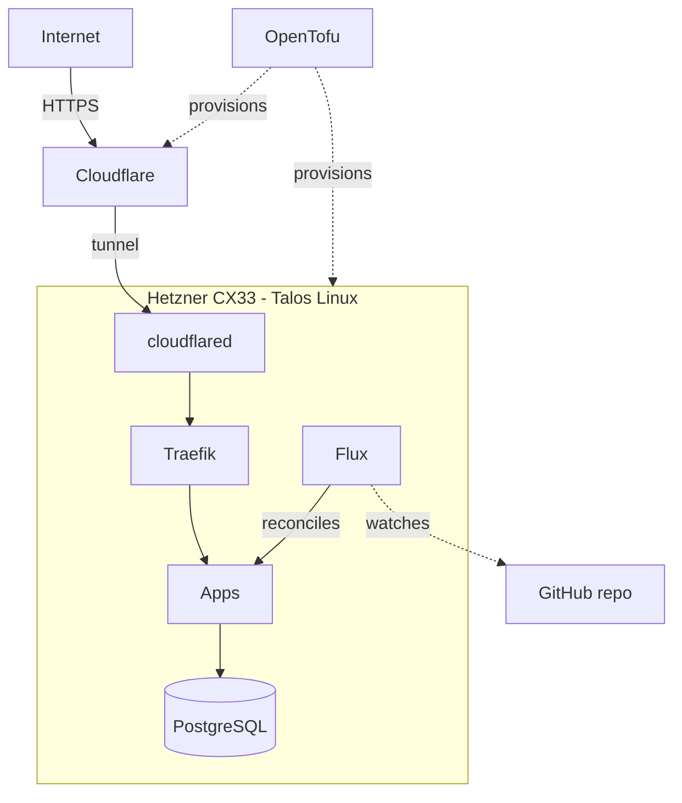

# Personal infrastructure

GitOps-managed personal infrastructure for `raveh.dev`.

## Architecture

## Stack

| Tool | Role |
|---|---|
| [Talos Linux](https://talos.dev) | Immutable Kubernetes OS |
| [Flux CD](https://fluxcd.io) | GitOps reconciliation |
| [OpenTofu](https://opentofu.org) | Infrastructure provisioning |
| [Traefik](https://traefik.io) | Ingress + reverse proxy |
| [Cloudflare Tunnel](https://developers.cloudflare.com/cloudflare-one/connections/connect-networks/) | Zero-trust ingress |
| [CNPG](https://cloudnative-pg.io) | PostgreSQL operator |
| [SOPS](https://github.com/getsops/sops) | Secret encryption (age + YubiKey) |

## Hardware

Single Hetzner CX33 (4 vCPU, 8 GB, 80 GB NVMe) for ~EUR 7/month + S3 as needed by apps.
No HA: All persistent data lives in S3. Full rebuild from git takes ~20 minutes.

## Development

[mise](https://mise.jdx.dev/) manages tool versions and all project
commands. Run `mise tasks` to see available commands.
