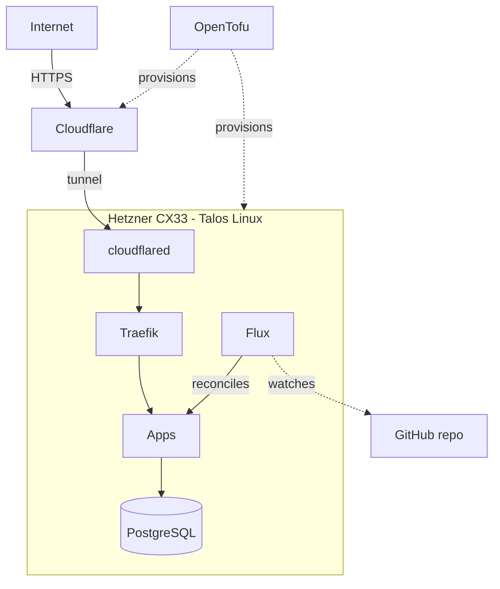

# shire - personal infrastructure

GitOps-managed personal infrastructure for `raveh.dev`. All secrets are SOPS-encrypted to YubiKey recipients.

## Architecture

## Stack

| Tool | Role |
|---|---|
| [Talos Linux](https://talos.dev) | Immutable Kubernetes OS |
| [Flux CD](https://fluxcd.io) | GitOps reconciliation |
| [OpenTofu](https://opentofu.org) | Infrastructure provisioning |
| [Traefik](https://traefik.io) | Ingress + reverse proxy |
| [Cloudflare Tunnel](https://developers.cloudflare.com/cloudflare-one/connections/connect-networks/) | Zero-trust ingress (no open ports) |
| [CNPG](https://cloudnative-pg.io) | PostgreSQL operator |
| [SOPS](https://github.com/getsops/sops) | Secret encryption (age + YubiKey) |

## Hardware

Single Hetzner CX33 (4 vCPU, 8 GB, 80 GB NVMe) for ~EUR 7/month. No HA - the node is cattle. All persistent data lives in S3 backups (CNPG PITR for Postgres, etcd snapshots, app-data tarballs). Full rebuild from git takes ~20 minutes.

## Development

[mise](https://mise.jdx.dev/) manages tool versions and all project
commands. Run `mise tasks` to see available commands.

## Docs

| Guide | What it covers |
|---|---|
| [setup.md](docs/setup.md) | YubiKey bootstrap ceremony, laptop prerequisites, full cluster rebuild (~20 min) |
| [deploying.md](docs/deploying.md) | Day-to-day workflows: cluster state changes, infra changes, Talos/K8s upgrades |
| [disaster-recovery.md](docs/disaster-recovery.md) | Single points of failure, restore procedures (etcd, CNPG PITR, app-data), YubiKey loss |
| [troubleshooting.md](docs/troubleshooting.md) | Symptoms-first triage: site down, Flux stuck, pod failures, etcd maintenance, tunnel debugging |
| [secrets.md](docs/secrets.md) | Threat model, SOPS encryption, key rotation |
