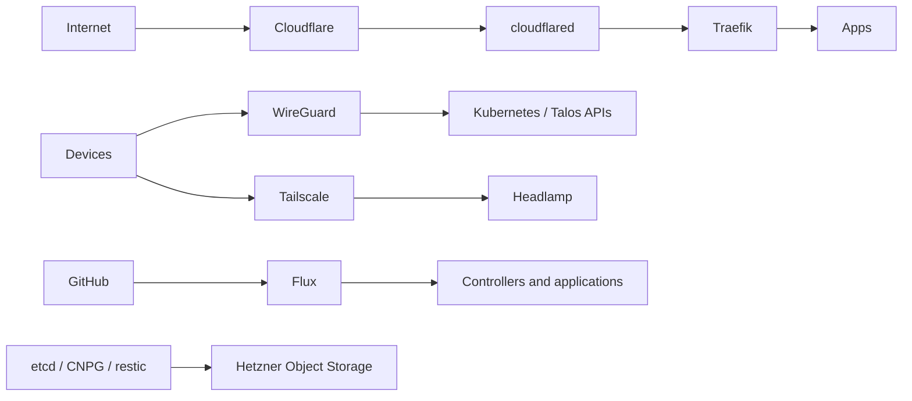

# `raveh.dev` infrastructure

OpenTofu and Flux configuration for Cloudflare and `shire`, a single-node Talos Kubernetes cluster on Hetzner.

[Setup](docs/setup.md) · [Deploying](docs/deploying.md) · [Secrets](docs/secrets.md) · [Cloudflare](docs/cloudflare.md) · [Troubleshooting](docs/troubleshooting.md) · [Recovery](docs/disaster-recovery.md)

```mermaid
flowchart LR
    Internet --> Cloudflare --> Tunnel[cloudflared] --> Traefik --> Apps
    Devices --> WireGuard --> APIs[Kubernetes / Talos APIs]
    Devices --> Tailscale --> Headlamp
    GitHub --> Flux --> Cluster[Controllers and applications]
    Backups[etcd / CNPG / restic] --> S3[Hetzner Object Storage]
```

| Path | Owns |
|---|---|
| [`tofu/`](tofu/) | Cloud resources, networking, account policies and provider credentials |
| [`clusters/shire/infrastructure/`](clusters/shire/infrastructure/) | Shared controllers and their configuration |
| [`clusters/shire/apps/`](clusters/shire/apps/) | Hosted applications: release selection, values, Secrets, ingress and backups |
| [`scripts/`](scripts/) | Infrastructure operations and validation |
| [`tests/`](tests/) | Shell behavior, manifest checks and disposable recovery fixtures |
| [`bootstrap/`](bootstrap/) | Initial hardware keys and encrypted credentials |

Application source, migrations and release packaging belong to their application repositories. Tool versions and commands are in [mise.toml](mise.toml); cluster sizing and versions are in [tofu/locals.tf](tofu/locals.tf).
