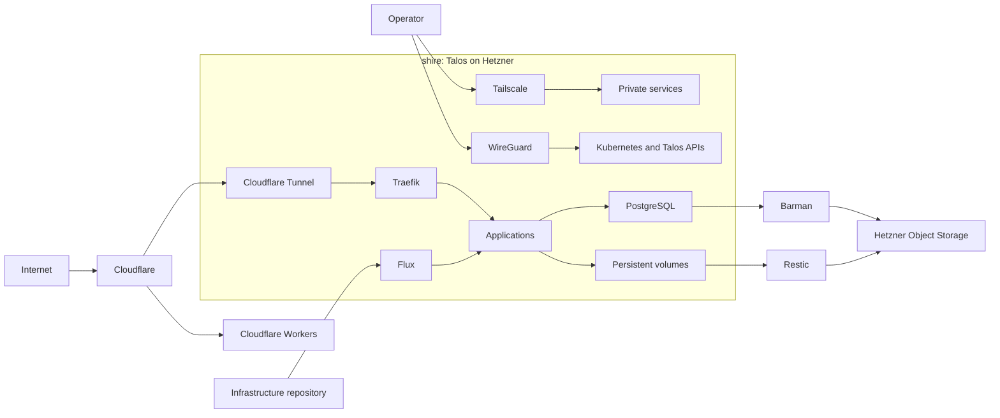

# Infrastructure

OpenTofu configuration and Kubernetes manifests for `raveh.dev` and the
`shire` cluster on Hetzner Cloud.

## Guides

- [Set up a workstation or rebuild the cluster](docs/setup.md).
- [Deploy infrastructure and application changes](docs/deploying.md).
- [Create and rotate secrets](docs/secrets.md).
- [Diagnose an outage](docs/troubleshooting.md).
- [Restore cluster and application data](docs/disaster-recovery.md).

Run commands from the repository root unless a guide says otherwise.
Tool versions and task definitions are in [mise.toml](mise.toml).

## Architecture

`shire` runs Kubernetes on one Talos control-plane node, which also runs
application workloads. Cloudflare Tunnel forwards public traffic to Traefik.
Tailscale exposes private services; WireGuard connects operator workstations
to the Kubernetes and Talos APIs.

Cloudflare Workers serve the root domain and applications hosted outside
Kubernetes. Application repositories deploy their own Workers; this repository
manages their custom domains.

```mermaid
flowchart LR
    Internet --> Cloudflare
    Cloudflare --> Workers[Cloudflare Workers]
    Cloudflare --> Tunnel[Cloudflare Tunnel]
    Operator --> WireGuard
    Operator --> Tailscale
    Git[Infrastructure repository] --> Flux
    subgraph Shire[shire: Talos on Hetzner]
        Tunnel --> Traefik --> App[Applications]
        Tailscale --> Private[Private services]
        WireGuard --> APIs[Kubernetes and Talos APIs]
        Flux --> App
        App --> PostgreSQL
        App --> PVC[Persistent volumes]
    end
    PostgreSQL --> Barman --> S3[Hetzner Object Storage]
    PVC --> Restic --> S3
```

## Repository layout

| Path | Contents |
|---|---|
| [tofu/](tofu/) | Cloud resources, Talos configuration, DNS and provider configuration |
| [clusters/shire/infrastructure/controllers/](clusters/shire/infrastructure/controllers/) | Cluster controllers and their credentials |
| [clusters/shire/infrastructure/configs/](clusters/shire/infrastructure/configs/) | Resources that depend on those controllers |
| [clusters/shire/apps/](clusters/shire/apps/) | Application releases, databases and backup jobs |
| [clusters/shire/flux-system/](clusters/shire/flux-system/) | Flux installation and Git synchronization |
| [bootstrap/](bootstrap/) | Encrypted recovery keys and initial provisioning script |
| [scripts/](scripts/) | Operator tasks and validation scripts |
| [tests/](tests/) | Bats tests for repository scripts |

OpenTofu changes require an operator apply. Flux reconciles Kubernetes
configuration from Git. Database, volume and etcd backups have separate
[restore procedures](docs/disaster-recovery.md); rebuilding infrastructure
does not restore application data.
