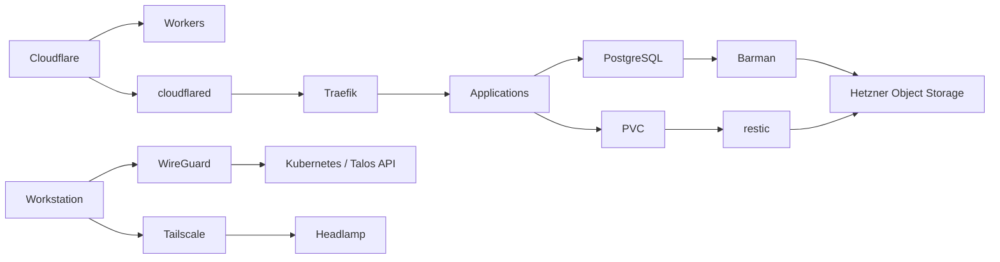

# raveh.dev infrastructure

OpenTofu and Flux configuration for `shire`, a single-node Talos Kubernetes
cluster on Hetzner Cloud, plus the Cloudflare resources for `raveh.dev`.

Public cluster traffic passes through Cloudflare Tunnel and Traefik. Tailscale
serves private applications. The Kubernetes and Talos APIs are reachable over
WireGuard. The root site, Quizmon and the personal site run on Cloudflare Workers.

```mermaid
flowchart LR
    Cloudflare --> Workers
    Cloudflare --> cloudflared --> Traefik --> Applications
    Workstation --> WireGuard --> APIs[Kubernetes / Talos API]
    Workstation --> Tailscale --> Headlamp
    Applications --> PostgreSQL --> Barman --> S3[Hetzner Object Storage]
    Applications --> PVC --> restic --> S3
```

## Working in this repo

- `tofu/`: cloud resources and Talos configuration. Apply with OpenTofu.
- `clusters/shire/`: Kubernetes manifests. Flux deploys changes merged to `main`.
- `mise.toml`: tool versions and operator commands.
- `.sops.yaml`: encryption recipients for committed secrets.

Run commands from the repository root with mise active in the shell.

## Docs

- [Workstation setup and cluster rebuilds](docs/setup.md)
- [Deploying changes](docs/deploying.md)
- [Secrets and key rotation](docs/secrets.md)
- [Cloudflare settings](docs/cloudflare.md)
- [Troubleshooting](docs/troubleshooting.md)
- [Backup recovery](docs/disaster-recovery.md)
